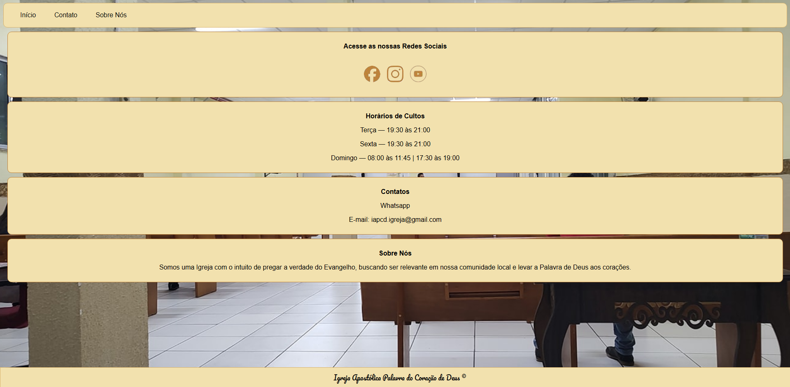

# 🙌 Projeto: Site da Minha Igreja

> Um site simples e moderno desenvolvido para a minha igreja, com foco em design limpo, responsividade e facilidade de navegação.

🌐 **Acesse o site:** [https://gabrielsilvasandes.github.io/igreja/]

---

## 📸 Demonstração

---

## 🧱 Estrutura do Projeto

📁 igreja/

├── 📂 imagens/ # Imagens utilizadas no site

├── 📄 index.html # Página principal

├── 🎨 style.css # Estilos do site

├── 📜 LICENSE # Licença MIT

└── 📘 README.md # Este arquivo

---

## 💡 Tecnologias Utilizadas

- **HTML5** — Estrutura do site  
- **CSS3** — Estilização e layout responsivo  
- **GitHub Pages** — Hospedagem gratuita do projeto

---

## 👨‍💻 Autor

**Gabriel Silva Sandes**  
📅 Projeto iniciado em **outubro de 2025**  
💼 Desenvolvedor Web e Designer 

🔗 [LinkedIn](https://www.linkedin.com/in/gabriel-silva-sandes)  
🐙 [GitHub](https://github.com/gabrielsilvasandes)

---

## ⚖️ Licença e Direitos de Uso

Este projeto está sob a licença **MIT**, **com restrições adicionais**:

- ✅ O **modelo de código (HTML e CSS)** pode ser utilizado e modificado livremente.  
- ❌ As **imagens, logotipos e informações da igreja** são **de uso exclusivo da instituição** e **não podem ser copiadas, redistribuídas ou utilizadas** em outros projetos sem autorização.

---
